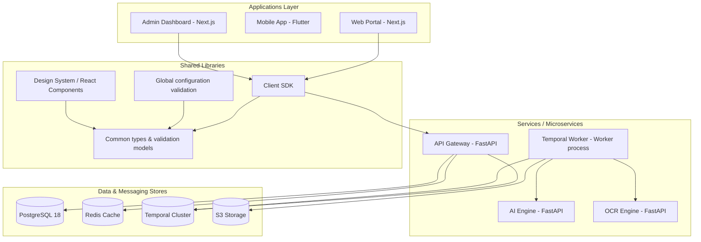

# LeadScan AI Architecture Reference

This document outlines the high-level architecture and interactions of the **LeadScan AI** platform.

## Directory Ownership & Mapping

- **Client apps** (`apps/`): Consume `@leadscan/sdk` and `@leadscan/ui` libraries.
- **Microservices** (`services/`): Decoupled Python microservices executing specialized tasks.
- **Shared Libraries** (`packages/`): Contains logic reusable across either the node workspace or python modules.
- **Infrastructure** (`infrastructure/`): Declarative setups (docker, kubernetes) configuring external resources.
