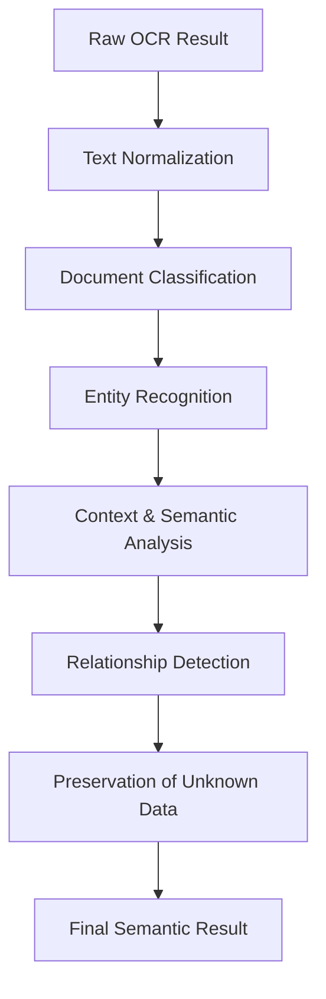

# AI Understanding Engine (BF-004)

The AI Understanding Engine takes raw OCR outputs, groups raw lines into logical sections, performs semantic document classification, extracts entities (like Name, Company, Email, Address), builds relationship networks, and logs unmapped/unknown data.

---

## 1. AI Understanding Pipeline

The semantic extraction stages are structured as follows:

### Pipeline Components:
1. **Text Normalization**: Standardizes spaces, lowercase conversions, and punctuation markers.
2. **Document Classification**: Evaluates spatial and textual layouts to classify documents (e.g. visiting cards, receipts, or A4 sheets).
3. **Entity Recognition**: Resolves specific entity tags (e.g. `Person`, `Company`, `Phone`, `Email`, `Website`).
4. **Context Analysis**: Uses surrounding key terms (e.g. "tel", "mail", "web") to refine entity boundary scores.
5. **Relationship Detection**: Matches entities together (e.g. linking a phone number or role to a specific person).
6. **Preservation of Unknown Data**: Isolates unclassified text chunks to avoid discarding any information.

---

## 2. Supported Document Types

Decoupled document categories include:
* `Visiting Card` / `Business Card`
* `A4 Document`
* `Invoice` / `Receipt`
* `Flyer` / `Poster`
* `Banner` / `Billboard` / `Shop Board`
* `Certificate` / `Letter`
* `Mobile Screen` / `Laptop Screen` / `Screenshot`
* `Unknown Document`

---

## 3. Entity Classification Catalog

Standard entity classifications parsed from the text:
* **Contact Details**: Phone, Email, Website, Social Media.
* **Entities**: Person, Company, Business, Department, Designation.
* **Geography**: Address, PIN, City, State, Country.
* **Transactional**: GST, Date, Time, Amount, Currency.
* **Metadata References**: QR Reference, Barcode Reference, Custom Entity.

---

## 4. Unknown Data Strategy

To prevent database data loss, any token that is parsed during OCR but cannot be successfully categorized by the AI provider is preserved:
- Logged inside the `UnknownEntity` database table.
- Stores the raw text value and a descriptive reason (e.g. "Suffix abbreviation ignored").
- Allows downstream processes or manual review sessions to inspect and reconstruct unmapped data.

---

## 5. Entity Relationship Mapping

Entities are linked semantically to represent real-world associations:
* **works_for**: Links `Person` to `Company`.
* **has_phone**: Links `Person` or `Company` to `Phone`.
* **has_email**: Links `Person` or `Company` to `Email`.
* **located_at**: Links `Person` or `Company` to `Address`.
