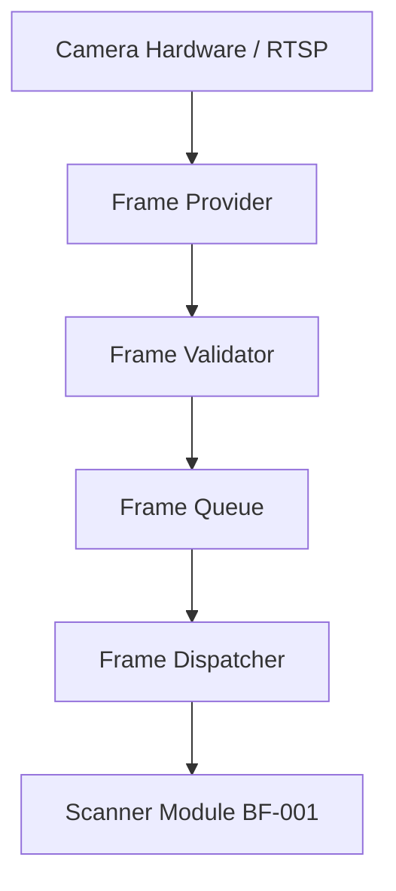

# Universal Camera Capture Engine (BF-002)

The Universal Camera Capture Engine provides the foundational infrastructure to connect, control, validate, and stream image frames from multiple camera hardware interfaces. It does not perform OCR or AI operations; it is dedicated purely to frame acquisition and delivery.

---

## 1. Frame Acquisition & Streaming Pipeline

The frame pipeline processes raw image feeds sequentially from hardware acquisition down to downstream subscribers (such as the BF-001 Universal Scanner module):

### Pipeline Components:
1. **Frame Provider (`IFrameProvider`)**: Controls connections to the camera hardware or network streams, handling start/stop operations, and reading raw frame buffers.
2. **Frame Validator (`IFrameValidator`)**: Validates the visual quality metrics of each frame (focus, illumination, blur, motion, stability).
3. **Frame Queue (`IFrameQueue`)**: Buffers frames in a FIFO queue structure to ensure thread-safe processing.
4. **Frame Dispatcher (`IFrameDispatcher`)**: Routes valid frames to downstream modules (e.g. BF-001 scanner job images).

---

## 2. Capture Modes

Supported capture strategies:
* **Single Capture**: Takes one frame.
* **Continuous Scan**: Streams frames continuously (e.g., for live previewing or continuous document checking).
* **Auto Capture**: Exposes hooks for future modules to automatically trigger captures when frames meet stability thresholds.
* **Manual Capture**: Triggers frame capture via user request.
* **Burst Capture**: Captures a rapid sequence of frames.

---

## 3. Image Quality Validation Checklist

The validation pipeline performs placeholder checks before processing frames:
* **Blur Detection**: Assesses spatial frequency changes.
* **Brightness / Dark Image**: Evaluates sensor luminance levels.
* **Over Exposure**: Flags highlights exceeding threshold levels.
* **Rotation / Skew**: Measures angle offsets.
* **Perspective**: Checks for perspective distortion.
* **Resolution**: Rejects inputs below minimal criteria (e.g. 640x480).
* **Frame Stability / Motion**: Inspects consecutive frame changes to prevent motion blur.

---

## 4. Hardware Parameters & Controls

The `ICameraControls` interface exposes configuration parameters:
* **Zoom**: Scale factor from `1.0` to `10.0`.
* **Focus**: Mode configuration (e.g. auto, manual, macro).
* **Flash / Torch**: Toggles camera flash or torch.
* **Exposure**: Relative exposure offset.
* **White Balance**: Color temperature mode.
* **Mirror / Orientation**: Rendering layouts.
* **Lens Selection**: Switches between front/rear cameras.

---

## 5. Security & Permission Management

The `IPermissionManager` interface verifies security requirements across platforms:
* **Desktop**: Direct hardware API permissions.
* **Android / iOS**: Verifies permission statuses in application manifests.
* **Web Browser**: Requests access permissions via the browser's UserMedia API.
