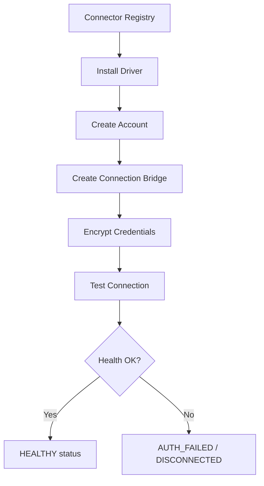

# Universal Connector Studio & Connection Manager (BF-010)

The Connector Studio manages external system connections for LeadScan AI. It connects to the Universal Sync Engine (BF-009) and provides a structured foundation for registering, configuring, testing, and monitoring third-party integrations.

---

## 1. Connector Studio Architecture

---

## 2. Connection Lifecycle

Every connection passes through the following stages:
1. **Driver Install**: Registers the connector type (Google Sheets, HubSpot).
2. **Account Binding**: Links user's external account (email, label, org).
3. **Connection Creation**: Creates a named bridge link with encrypted credentials.
4. **Test**: Sends a ping handshake to validate the connection endpoint.
5. **Health Monitoring**: Periodic latency and status checks logged to `ConnectorHealth`.
6. **Refresh**: OAuth token refresh routine invoked before expiry.
7. **Audit**: All operations written to `ConnectorAudit` for compliance trails.

---

## 3. Security Architecture

Credential security boundaries:
- **`ISecurityEngine`**: Declares encrypt/decrypt and key rotation contracts.
- **`ConnectorCredential` model**: Stores encrypted access tokens only — never plaintext.
- **`ConnectorAudit` model**: Logs every sensitive action (login, refresh, delete) with user ID.
- **`ConnectorPermission` model**: Enforces READ / WRITE / ADMIN access boundaries.

---

## 4. Google Connector Foundation

The Google connector is the first supported integration:
- **OAuth Flow**: Standard Authorization Code Flow architecture — code exchange not implemented.
- **Token Storage**: Access and refresh tokens stored in `ConnectorCredential`.
- **Scope Management**: Scopes tracked as metadata on `ConnectorConnection`.
- **Token Expiry**: `expires_at` field on `ConnectorCredential` drives refresh scheduling.

---

## 5. Future Connector Strategy

The architecture supports unlimited future connectors:
- New drivers are installed via `POST /connectors-studio/drivers/install`.
- New connector types are added to `ConnectorType` enums.
- Each connector implements `IConnector` from BF-009 for push operations.
- Health, audit, and permission models are shared universally across all connectors.
