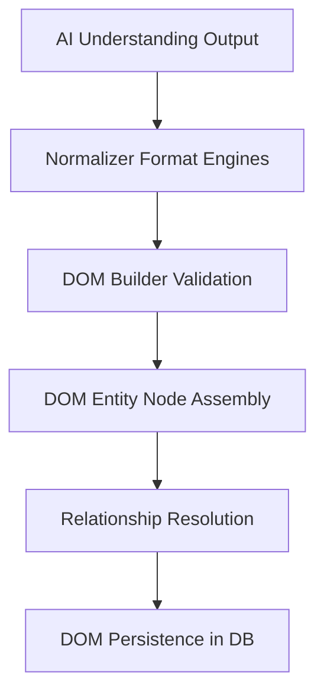

# Smart Field Detection & Document Object Model (DOM) Engine (BF-005)

The Document Object Model (DOM) acts as the single source of truth for LeadScan AI. It standardizes processed documents into a tree representation consisting of Sections, Logical Groups, Entities, Attributes, and Relationships.

---

## 1. Document Object Model Structure

The DOM is represented as a structured node tree:

```
Document (Root node: class type, status)
  ├── DocumentSection (Header, Body, Footer partitions)
  ├── EntityGroup (Logical group of entities, e.g. "Primary Contact Card")
  │     └── Entity (Entity classification, value, normalized value)
  │           └── EntityAttribute (position, language, review status)
  ├── EntityRelationship (Links entities together: parent/child, references)
  ├── ExtraInformation (Preserves unmapped raw text chunks with coordinates)
  └── UnknownEntity (Preserves unrecognized token values to prevent data loss)
```

---

## 2. Entity Ingestion Flow

The pipeline translates inputs from AI understanding into standardized DOM structures:



### Flow Steps:
1. **AI Output Mapping**: Ingests document classification, entities, and relationship links.
2. **Field Normalization**: Standardizes specific attribute values (e.g. converting phone numbers to +E.164, parsing currencies).
3. **DOM Assembly**: Groups entities into layout Sections and EntityGroups.
4. **Relational Sync**: Links nodes together and logs extra unmapped blocks.

---

## 3. Normalization Strategy

Abstractions are defined to standardize the formatting of the following fields:
* **Phone**: Formats to +E.164 (e.g. cleans spaces, dashes, prepends country code).
* **Email**: Trims and converts to lowercase.
* **Website**: Validates and prepends protocols (`https://`).
* **GST / PAN**: Converts tax values to uppercase and validates digit layouts.
* **Address**: Sanitizes spacing and standardizes street tags.
* **Date**: Normalizes string representations into `YYYY-MM-DD`.
* **Currency**: Converts symbols or text representations to ISO 4217 standard codes.

---

## 4. Extra Information Strategy

To guarantee that no extracted data is lost during processing:
- Any raw text block that is not mapped to a specific entity type is saved inside the `ExtraInformation` database table.
- Stores raw text, confidence score, and bounding box coordinates.
- Enables manual review sessions or future AI models to inspect and retrieve omitted data.

---

## 5. Future Integration Strategy

The DOM Engine is designed as the unique backend endpoint for downstream sync modules:
* **Dynamic Mapping (BF-006)**: Inspects the DOM structure and maps fields based on target schema templates.
* **Manual Review (BF-007)**: Exposes endpoints to patch `EntityAttribute` values and set review statuses to `APPROVED` or `REJECTED`.
* **Google Sheets / CRM Sync (BF-008, BF-010)**: Connects to target external services and updates records matching DOM node changes.
