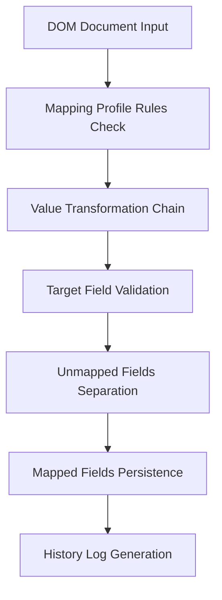

# Dynamic Mapping Engine (BF-006)

The Dynamic Mapping Engine converts a standardized Document Object Model (DOM) into target schema formats tailored to third-party integrations (such as CRM systems, databases, or Google Sheets).

---

## 1. Mapping Pipeline Flow

The mapping processing workflow operates as follows:

---

## 2. Dynamic Mapping Profiles

Users can define unlimited Mapping Profiles per Workspace or Organization.
Each profile specifies:
* **Source Entity Type**: The DOM Entity Type (e.g. `Person`, `Company`, `Phone`).
* **Target Field Name**: The key name expected by the destination system (e.g. `first_name`, `organization`).
* **Field Type**: Expected data types (Text, Number, Email, Boolean, Currency, Address, Array, etc.).
* **Default Value**: Fallback string used if the DOM node is missing.
* **Transformations**: Chained formatting rules (Trim, Lowercase, Normalize).
* **Validations**: Constraint assertions (Length, Regex).

---

## 3. Transformation & Validation Flow

For each matching entity:
1. **Extraction**: The raw DOM value is read.
2. **Transformation Rule Sequence**:
   - `Trim`: Removes leading/trailing spaces.
   - `Uppercase / Lowercase`: Formats letter casing.
   - `Phone / Email Normalize`: Standardizes formatting strings.
3. **Validation Check Run**:
   - `Required`: Fails if empty.
   - `Length`: Evaluates character limits.
   - `Regex`: Checks pattern compliance.
   If validation errors occur, execution halts and returns a validation summary.

---

## 4. Unmapped Data Strategy

To ensure zero data loss during export pipelines:
- Any entity in the DOM document that is not mapped by the profile rules is stored separately under `UnmappedField` log tables.
- Retains raw value text and bounding boxes for audits.
- Downstream systems can inspect unmapped logs to refine profile rules.

---

## 5. Version History & Audits

Ensures audit readiness for enterprise deployments:
- Updates to mapping profiles increment the `version` field.
- A snapshot is generated and saved inside `MappingHistory` tables detailing the version number, updating author, and exact JSON properties.
- Enables rolling back configurations.
