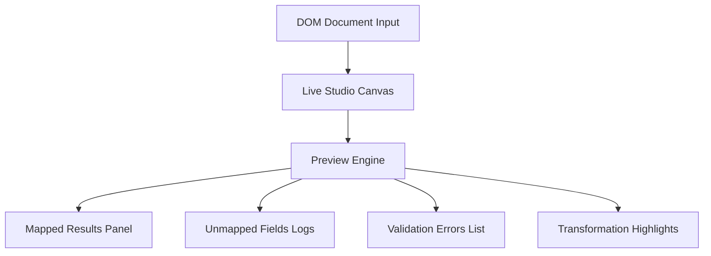

# Mapping Studio & Rule Builder (BF-007)

The Mapping Studio provides the visual interface and rule builders where users define custom mapping profiles, transformation chains, and validation constraints. It integrates with the Dynamic Mapping Engine (BF-006) to apply rules to the Document Object Model (DOM).

---

## 1. Visual Drag & Drop Canvas

The studio canvas enables mapping DOM elements to target integrations:

* **Source Elements**: Displays the identified DOM tree hierarchy (e.g. sections, entities).
* **Target Columns**: Lists available column definitions for the target (e.g. CRM fields, sheet headers).
* **Drag & Drop mapping**: Establishes links (one-to-one, one-to-many, many-to-one, nested).
* **Search**: Search rules, profiles, or entity fields.

---

## 2. Rule Builder Condition Grammar

The condition parser supports complex logic chaining to execute mappings conditionally:

```
[Condition Definition]
  ├── logical_operator: AND / OR / NOT / IF / ELSE
  └── criteria:
        ├── field: DOM Entity type or attribute
        ├── operator: Contains, Starts With, Ends With, Regex
        └── value: Text pattern to compare
```

* **AND / OR / NOT**: Combines multiple criteria blocks.
* **Contains / Starts With / Ends With**: String prefix/suffix checking.
* **Regex**: Direct regular expression pattern matching.

---

## 3. Transformation & Validation Builders

Live builders chain format conversions and assertions prior to export:

* **Transformation Builder**: Trim, Casing, Replace, Split, Merge, Join, Date/Phone normalizations.
* **Validation Builder**: Required/Optional constraints, Length bounds, Regex format compliance, Custom JavaScript rules.

---

## 4. DOM Live Preview Engine

Renders output fields live as rules are modified:



---

## 5. Profile Management & Version Control

Provides profile lifecycles:
* **Duplicate Profile**: Creates copies of configurations for variations.
* **Import / Export**: Port profiles across workspaces using a standard JSON structure.
* **Favorites**: Pin frequently-used profiles.
* **History / Rollback**: Roll back configurations to earlier version snapshots.
