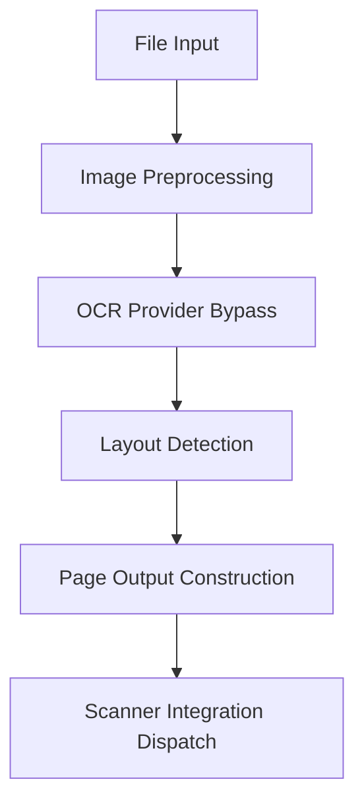

# OCR Processing Engine (BF-003)

The OCR Processing Engine coordinates document file loading, applies preprocessing enhancements, executes OCR provider stubs, constructs layout hierarchies (blocks, lines, words), and reports raw text outcomes.

---

## 1. Pipeline Execution Flow

The OCR Pipeline processes document images sequentially:



### Pipeline Steps:
1. **Image Preprocessing**: Refines inputs using resize, deskew, denoise, and brightness filters.
2. **OCR Provider**: Delegates text extraction to provider engines (Tesseract, Google Vision, etc.).
3. **Layout Detection**: Groups raw character offsets into structured block, line, and word hierarchies.
4. **Scanner Dispatch**: Exposes the extracted raw text to the BF-001 scanner system.

---

## 2. Image Preprocessing Catalog

Operations configured to optimize character recognition:
* **Resize**: Adapts document scales to standard dimensions.
* **Deskew**: Computes and corrects page angle skew rotations.
* **Denoise / Noise Removal**: Filters high-frequency pixels and speckles.
* **Contrast / Brightness**: Enhances edge separations.
* **Rotation**: Align page orientations.
* **Perspective Correction**: Rectifies distortion in camera snapshots.
* **Crop**: Trims document borders to focus on content.

---

## 3. Supported OCR Providers

Abstractions support the following engine integrations:
* **Tesseract**: Open-source CPU-bound engine.
* **PaddleOCR**: Lightweight deep learning engine.
* **Google Vision / Azure OCR**: Enterprise cloud-based OCR APIs.
* **AWS Textract**: Document layout parsing API.
* **EasyOCR**: Python-based PyTorch engine.

---

## 4. Multi-Language Support

Includes standard language mappings:
* **en**: English
* **hi**: Hindi
* **mr**: Marathi
* **gu**: Gujarati
* **ta**: Tamil
* **te**: Telugu
* **kn**: Kannada
* **ml**: Malayalam
* **pa**: Punjabi
* **bn**: Bengali

---

## 5. Output Layout Hierarchy

Extracted data is stored in the database according to the following hierarchy:

```
OCRJob (parent request)
  └── OCRPage (page number, dimensions, raw text)
        └── OCRBlock (index, paragraphs/tables, bounding box)
              └── OCRLine (index, raw text, bounding box)
                    └── OCRWord (index, text value, bounding box, character spans)
```

Each structural element holds:
- **Bounding Box**: Normalized coordinate properties on a `0.0` - `1.0` scale.
- **Confidence**: Normalized certainty score (`0.0` - `1.0`).
- **Positioning indexes**: Line, block, and word order offsets.
