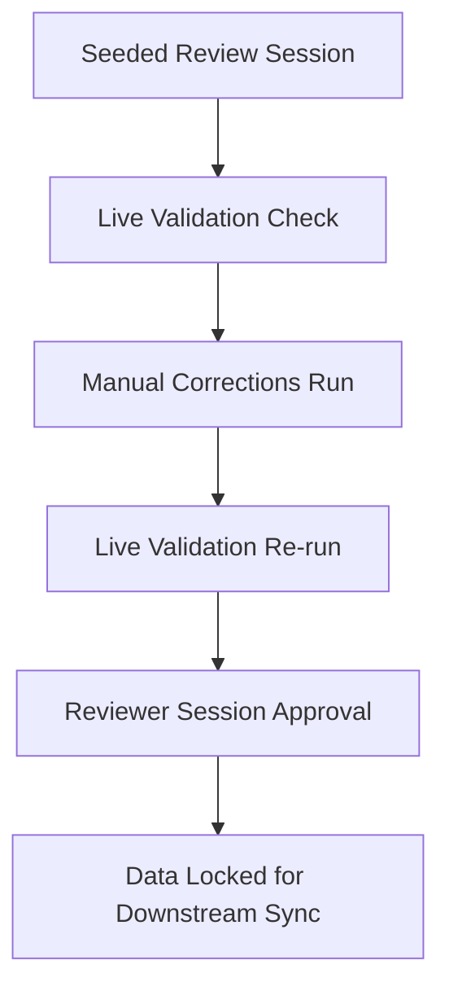

# Review Workspace & Data Correction (BF-008)

The Review Workspace serves as the final data verification stage before lead structures sync to target systems. It consolidates OCR data, DOM entities, mapped targets, confidence scores, and unmapped extra information.

---

## 1. Review and Approval Flow

The correction and approval sequence operates as follows:

---

## 2. Manual Data Corrections

Reviewers can edit and restructure captured data:
* **Edit Field**: Override values manually.
* **Delete Field**: Discard entries.
* **Add Field / Restore**: Reinstate values.
* **Status tagging**: Fields default to `Pending` and progress to `Approved` or `Rejected`.

---

## 3. Extra Information & Preservation

Ensures zero information loss:
- Displays all unmapped entities from the document DOM tree.
- Reviewers can manually promote extra info elements into mapped fields.
- Elements are never discarded automatically.

---

## 4. Confidence Filtering

Data is flagged based on confidence scores:
- **High**: Confidence >= 0.90.
- **Medium**: Confidence >= 0.70.
- **Low**: Confidence < 0.70.
- Reviewers can filter fields by confidence levels to focus on low-confidence entries first.

---

## 5. Validation Checks

Live validation issues are calculated and saved:
* **Missing required fields**: Highlights empty mandatory elements.
* **Format violations**: Standard checks for emails, phone numbers, website URLs, and GST numbers.
* **Duplicate values**: Spots repeating values.

---

## 6. Correction History & Revisions

Maintains revision audit logs in the `CorrectionHistory` table:
* Captures the reviewer ID and timestamp.
* Logs the old value and the new replacement value.
* Logs the correction reason (e.g. "Fix OCR typo").

---

## 7. Downstream Integrations

Approved sessions act as the unique trigger boundary for downstream sync integrations:
- **Google Sheets Sync (BF-009)**: Converts approved sessions directly to rows.
- **CRM Sync (BF-010)**: Sends approved items to CRM platforms.
