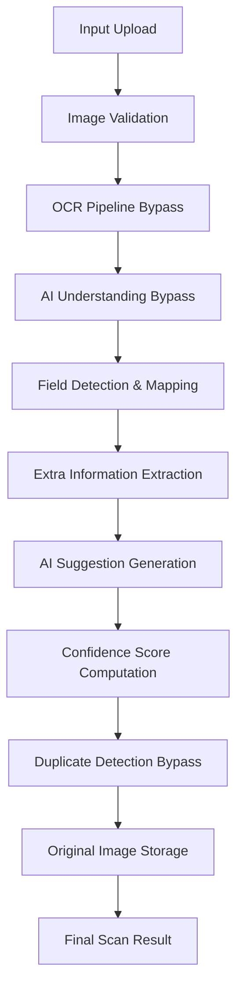

# Universal Smart Scanner Foundation (BF-001)

The Universal Smart Scanner Foundation establishes the architecture for processing unstructured scanned inputs, validating them, extracting structured field data, maintaining unmapped leftovers, predicting metadata classification, and facilitating human-in-the-loop overrides and duplicate searches.

---

## 1. Scanner Flow & Pipeline

The pipeline is orchestrated by the `IScanPipeline` interface. It processes document data sequentially through the following structured stages:

### Pipeline Steps:
1. **Input & Image Validation**: Verifies file type, MIME configuration, image resolution, and metadata to ensure suitability for scanning without modifications.
2. **OCR Bypass**: A structural mock that extracts raw text characters from document images.
3. **AI Understanding Bypass**: Analyzes raw OCR outputs and extracts structured entities.
4. **Field Detection & Mapping**: Maps discovered entities to standardized business keys (`Person Name`, `Company Name`, etc.).
5. **Extra Information Extraction**: Catches any text fragments that could not be mapped to preserve every element.
6. **AI Suggestion Generation**: Proposes high-level metadata (e.g. document classification, possible websites, or duplicate warnings).
7. **Confidence Score Computation**: Calculates the overall confidence score of the scan output.
8. **Duplicate Detection Bypass**: Looks for potential duplicate records across standard fields.
9. **Original Image Storage**: Records file metadata paths without compressing or modifying original image files.
10. **Final Scan Result**: Consolidates fields, extra info, suggestions, and confidence scores into database persistence models.

---

## 2. Smart Field Detection Catalog

The system standardizes fields into distinct types:
* **Core Info**: `Person Name`, `Company Name`, `Business Name`
* **Contact Details**: `Phone`, `Mobile`, `Email`, `Website`, `Social Media`
* **Address Info**: `Address`, `PIN`, `City`, `State`, `Country`
* **Corporate metadata**: `GST`, `Designation`, `Department`
* **Retail & Contextual Info**: `Opening Hours`, `Business Category`
* **Extensible**: `Custom Fields` (represented by custom key-value metadata mapping)

---

## 3. Extra Information Preservation

To guarantee that no scanned details are lost during mapping:
* Any text segment that does not map to standard attributes is routed into `ExtraInformation`.
* Raw string data, coordinates (bounding boxes), and confidence metrics are retained.
* This ensures that downstream manual correction can recover fields missed by automated mapping.

---

## 4. Confidence & Bounding Boxes

Every mapped field and extra information record holds:
1. **Value**: The raw string content.
2. **Confidence**: Normalized float between `0.0` (zero certainty) and `1.0` (absolute certainty).
3. **Source**: Origin of detection (e.g. `OCR`, `AI_UNDERSTANDING`, `MANUAL`).
4. **Bounding Box**: JSON coordinate properties normalized to a `0.0` - `1.0` float grid:
   * `x`: Horizontal offset starting from top-left.
   * `y`: Vertical offset starting from top-left.
   * `width`: Field block width.
   * `height`: Field block height.

---

## 5. Manual Review Lifecycle

When confidence is low (e.g., `< 0.8`), or when flagged by users, results enter `MANUAL_REVIEW`. The `IManualReviewEngine` supports:
* **Edit**: Correct values, update confidence to `1.0`, and label the source as `MANUAL`.
* **Delete**: Remove incorrect field mappings.
* **Merge**: Combine multiple field values into a single target field.
* **Split**: Separate a combined field value into multiple separate fields.
* **Rename**: Reclassify the field category label.
* **Approve / Reject**: Confirm the final result or mark it failed, updating the parent job status.

---

## 6. Duplicate Detection Specification

The comparison engine (`IDuplicateDetectionEngine`) defines checks to evaluate match criteria:
* **Compare by Phone**: Validates mobile/phone structures.
* **Compare by Email**: Resolves unique email addresses.
* **Compare by Website**: Canonicalizes URLs to trace common domains.
* **Compare by GST**: Identifies matching corporate Tax IDs.
* **Compare by Company**: Matches text structures of company names.
* **Compare by Person Name**: Matches contact names.
