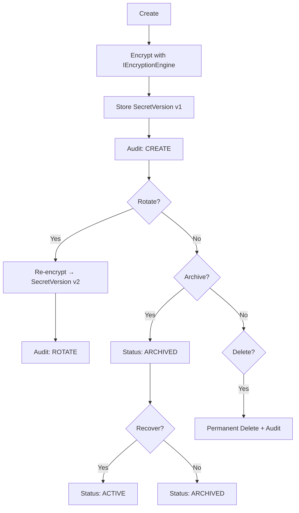

# Enterprise Secret Vault & Credential Manager (BF-011)

The Enterprise Secret Vault provides a centralised, encrypted, audited store for all external credentials. No connector or module may access raw credentials directly — every secret retrieval must pass through the vault's access control and audit pipeline.

---

## 1. Secret Lifecycle



---

## 2. Encryption Strategy

| Layer | Mechanism |
|---|---|
| Secret value | AES-256-GCM (stub prefix `ENC_V1::`) |
| Envelope | Data key encrypted by master key |
| Checksum | SHA-256 per version for integrity |
| Key Reference | `key_reference` field on `SecretVersion` |
| Future HSM | `IKeyManager.get_master_key()` abstraction ready |
| Future KMS | Drop-in replacement behind `IKeyManager` interface |

---

## 3. Key Rotation Strategy

- **Per-secret rotation**: `POST /vault/secrets/{id}/rotate` re-encrypts and creates a new `SecretVersion`.
- **Master key rotation**: `POST /vault/keys/rotate` stubs a key version upgrade. All new versions reference the new key ID.
- **Scheduled rotation**: `SecretRotation` model tracks `interval_days`, `next_rotation_at`, and `rotation_count`.
- **Policy-driven**: `SecretPolicy.auto_rotate` drives automated rotation scheduling.

---

## 4. Access Control Model

| Role | Can Read | Can Rotate | Can Archive | Can Delete | Can Grant |
|---|---|---|---|---|---|
| OWNER | ✓ | ✓ | ✓ | ✓ | ✓ |
| ADMIN | ✓ | ✓ | ✓ | ✓ | ✗ |
| EDITOR | ✓ | ✓ | ✗ | ✗ | ✗ |
| VIEWER | ✓ | ✗ | ✗ | ✗ | ✗ |
| READ_ONLY | ✓ | ✗ | ✗ | ✗ | ✗ |
| CONNECTOR_ACCESS | ✓ | ✗ | ✗ | ✗ | ✗ |
| SCOPED_ACCESS | Scoped | ✗ | ✗ | ✗ | ✗ |

---

## 5. Audit Trail

Every vault operation writes a `SecretAudit` entry containing:
- `actor_id`: who performed the action
- `action`: CREATE, READ, ROTATE, ARCHIVE, RECOVER, DELETE, ACCESS_ATTEMPT, ROTATION_FAILURE
- `old_version` / `new_version`: version references for rotation audits
- `success`: boolean, `False` on denied access attempts or rotation failures
- `reason`: optional free-text justification

---

## 6. Connector Integration Pattern

Connectors in BF-010 must retrieve credentials exclusively via:
```
GET /vault/secrets/{secret_id}  →  SecretVaultService.retrieve_secret()
```
The connector's `connector_id` is registered as a `SecretAccess` grant with `CONNECTOR_ACCESS` role. Raw tokens are never stored in `ConnectorCredential` directly — they reference a vault `secret_id`.

---

## 7. Future HSM / KMS Compatibility

The `IKeyManager` interface is the single abstraction point:
- Swap `SecretVaultService.get_master_key()` for an AWS KMS / GCP Cloud KMS call.
- Swap `SecretVaultService.encrypt()` for an HSM-backed AES call.
- No other code requires changes.
