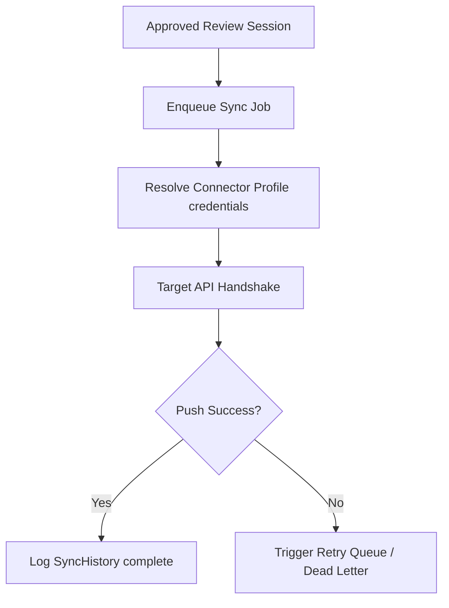

# Universal Sync Engine & Google Sheets Connector (BF-009)

The Universal Sync Engine manages data synchronization between LeadScan AI and third-party destinations. It receives approved records from the Review Workspace (BF-008) and pushes them to target integrations based on mapping profiles.

---

## 1. Sync Queue Dispatch Flow

The synchronization dispatch sequence is coordinated as follows:

---

## 2. Connector Registry & Factory

The architecture decouples the sync pipeline from connector endpoints:
* **`IConnector` interface**: Defines common authentication and data push operations.
* **`Connector` model**: Registers available integrations (Google Sheets, HubSpot, Zoho, Salesforce).
* **`IConnectorFactory`**: Fabricates target wrapper clients dynamically.

---

## 3. Google Sheets Connector Foundation

Google Sheets is the primary integration destination:
* **OAuth Flow**: Standardized OAuth authentication (workbook and worksheet discovery).
* **Sync targets**: Profile settings mapping DOM elements to sheet columns.
* **Write modes**: Appends new rows, updates existing rows based on key fields, or runs batch uploads.

---

## 4. Sync Job Retries & Dead Letter Queue

Prevents loss of sync updates during network or rate-limit failures:
* Failed jobs log `SyncHistory` error notes and increment `retry_count`.
* Automatic retry loops check for jobs in the retry queue and re-trigger uploads.
* If a job exceeds `max_retries` (default: 3), it moves to the **Dead Letter Queue (DLQ)** with status `Failed`, requiring manual action.
